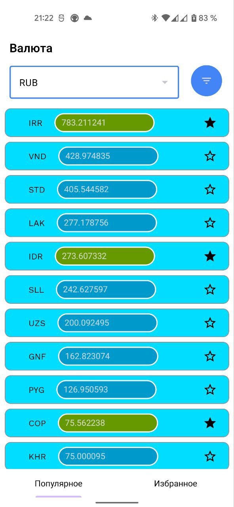
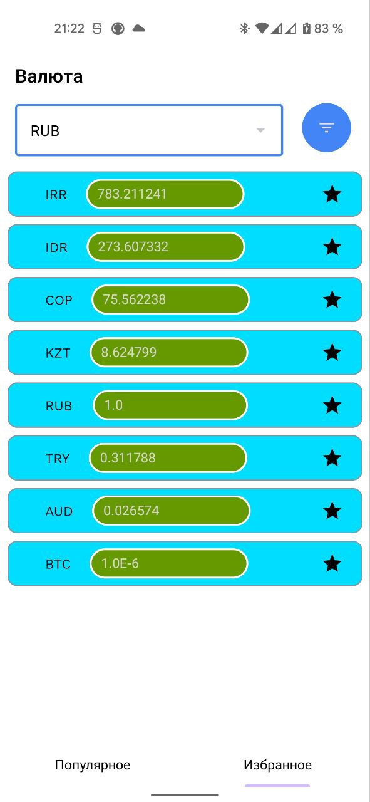
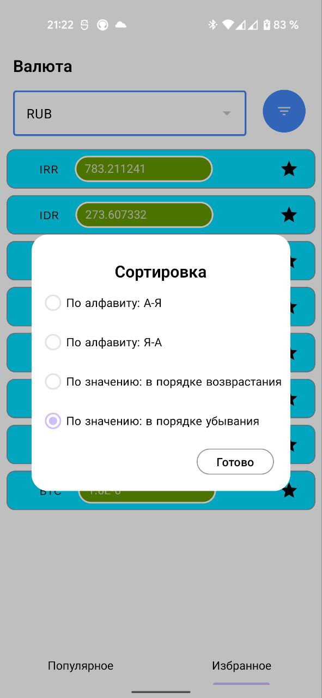

# **ExchangeRate**

Тестовое задание отслеживание курса валют

Используемые технологии
* Kotlin
* Kotlin Coroutines
* Kotlin Flow
* MVVM + Clean Architecture
* Dagger 2
* Retrofit2 & OKHTTP3
* ViewBinding

| Популярное                     | Избранное                       | Сортировка                       |
|--------------------------------|---------------------------------|----------------------------------|
|  |  |  |